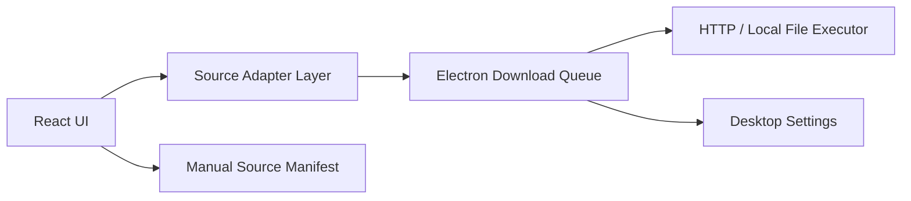

# HongGuo Tool Framework

一个面向桌面工具方向演进的短剧资源管理框架，当前技术栈为 `React + Vite + TypeScript + Electron`。

这个项目的目标不是做某个平台的专用下载器，而是提供一套可复用的“桌面壳 + 任务队列 + 下载执行层 + 数据源适配器”骨架，方便你接入自己合法持有的直链、本地文件、对象存储或内部资源库。

## 项目定位

- 提供桌面化资源管理工作台
- 提供真实文件下载执行层
- 提供可替换的数据源适配器层
- 提供手动资源清单导入导出能力
- 保持和具体平台解耦，方便后续换源

## 当前能力

- Electron 桌面窗口与预加载桥接
- 资源搜索、分类浏览、分辨率切换
- 单集加入队列 / 全部加入队列
- 真实下载执行层
- HTTP/HTTPS 直链文件下载
- 本地文件复制式下载
- 暂停 / 恢复 / 失败重试 / 并发控制
- 暂停后从断点继续下载
- 下载任务持久化与应用重启恢复
- 下载任务状态筛选与关键词搜索
- 下载日志持久化、级别筛选、关键词搜索与 JSON 导出
- 下载健康度统计面板，支持按适配器与失败原因聚合查看
- 已完成任务的打开文件 / 打开所在位置
- 原生下载目录选择与打开目录
- 用户配置写入 Electron `userData` 目录
- 手动资源模板录入
- 手动资源清单 JSON 导入 / 导出
- 本地资源库清单 JSON 导入 / 导出
- 从内部 HTTP API 同步资源库并缓存到本地
- 多个资源发现源配置的保存、切换、删除与快速同步
- 浏览器模式下的队列模拟预览

## 合规边界

- 不接入红果短剧或任何第三方视频平台
- 不实现平台资源抓取、批量解析、绕过限制或未授权下载
- 当前真实下载层只处理“直接文件资源”，不处理流媒体分片解析
- 适配器层应只返回你有权使用的直链或本地文件路径

## 快速开始

### 1. 安装依赖

```bash
npm install
```

### 2. 启动桌面开发模式

```bash
npm run dev:desktop
```

这会同时启动：

- Vite 前端开发服务
- Electron 桌面窗口

### 3. 浏览器预览

```bash
npm run dev
```

浏览器模式主要用于界面调试和队列预览，不包含 Electron 原生文件对话框。

## 常用脚本

```bash
npm run dev
npm run dev:desktop
npm run build
npm run lint
npm run build:desktop
npm run dist:win
```

说明：

- `dev`: 只启动 Vite
- `dev:desktop`: 启动 Vite + Electron
- `build`: 构建前端产物
- `lint`: 执行 ESLint
- `build:desktop`: 生成桌面目录包
- `dist:win`: 生成 Windows 安装包

## 系统结构



### 分层说明

1. `React UI`
   负责资源展示、任务操作、表单录入、导入导出。

2. `Source Adapter Layer`
   把资源条目和剧集信息转换成统一的下载任务描述。

3. `Electron Download Queue`
   负责并发控制、状态切换、暂停恢复、任务广播。

4. `HTTP / Local File Executor`
   负责真正的文件传输。

5. `Desktop Settings`
   负责保存下载目录、默认清晰度、最大并发数。

## 关键目录

- [electron/main.cjs](/D:/HongGuo_AutoTools/electron/main.cjs)
  Electron 主进程、下载调度、文件保存、IPC。

- [electron/preload.cjs](/D:/HongGuo_AutoTools/electron/preload.cjs)
  安全桥接层，把桌面能力暴露给前端。

- [src/App.tsx](/D:/HongGuo_AutoTools/src/App.tsx)
  主界面、任务交互、导入导出入口、日志中心。

- [src/sourceAdapters.ts](/D:/HongGuo_AutoTools/src/sourceAdapters.ts)
  兼容入口，对外统一导出适配器能力。

- [src/adapters/registry.ts](/D:/HongGuo_AutoTools/src/adapters/registry.ts)
  适配器注册中心，统一聚合内置适配器和自定义适配器。

- [src/adapters/custom/index.ts](/D:/HongGuo_AutoTools/src/adapters/custom/index.ts)
  自定义适配器注册入口，后续业务扩展优先改这里。

- [src/manualSources.ts](/D:/HongGuo_AutoTools/src/manualSources.ts)
  手动资源清单的导入、导出、解析、合并。

- [src/discoveredSources.ts](/D:/HongGuo_AutoTools/src/discoveredSources.ts)
  资源发现层的数据结构、资源库清单解析、系列构建与合并。

- [src/desktop.ts](/D:/HongGuo_AutoTools/src/desktop.ts)
  桌面上下文、任务类型、IPC 类型。

- [adapter-templates/custom-direct-file.adapter.template.ts](/D:/HongGuo_AutoTools/adapter-templates/custom-direct-file.adapter.template.ts)
  自定义适配器模板。

- [adapter-examples/team-library.adapter.example.ts](/D:/HongGuo_AutoTools/adapter-examples/team-library.adapter.example.ts)
  自定义适配器示例。

- [docs/adapter-development.md](/D:/HongGuo_AutoTools/docs/adapter-development.md)
  适配器开发说明。

- [docs/resource-discovery.md](/D:/HongGuo_AutoTools/docs/resource-discovery.md)
  资源发现层说明。

- [resource-library.template.json](/D:/HongGuo_AutoTools/manifest-templates/resource-library.template.json)
  本地资源库清单模板。

## 下载任务执行链路

1. UI 选中剧集并点击下载
2. `resolveEpisodeDownload()` 根据 `adapterId` 找到适配器
3. 适配器返回统一下载描述：
   `taskId / sourceUrl / fileName / resolution`
4. Electron 主进程将任务加入队列
5. 调度器根据最大并发数启动任务
6. 执行器根据 `sourceUrl` 选择：
   HTTP/HTTPS 下载
   或本地文件复制
7. 进度通过 IPC 推回前端界面

## 适配器架构

现有内置适配器：

- `demo-library`
  返回公开演示视频直链，用于验证完整链路。

- `manual-template`
  把手动录入的 URL 模板解析成最终下载地址，是后续换源时最常改的一层。

适配器最小职责只有一个：

- 把“业务资源信息”转换成“可执行下载任务”

适配器最终必须返回：

- `taskId`
- `adapterId`
- `seriesId`
- `seriesTitle`
- `episodeId`
- `episodeTitle`
- `resolution`
- `sourceUrl`
- `fileName`

也就是说，下载执行层不关心资源来自哪里，只关心你是否给出了合法直链或本地文件路径。

### 开发入口

- 模板：[custom-direct-file.adapter.template.ts](/D:/HongGuo_AutoTools/adapter-templates/custom-direct-file.adapter.template.ts)
- 示例：[team-library.adapter.example.ts](/D:/HongGuo_AutoTools/adapter-examples/team-library.adapter.example.ts)
- 文档：[adapter-development.md](/D:/HongGuo_AutoTools/docs/adapter-development.md)
- 自定义注册入口：[index.ts](/D:/HongGuo_AutoTools/src/adapters/custom/index.ts)

## 手动资源模板

手动资源支持以下令牌：

- `{episode}`
- `{episodeIndex}`
- `{seriesId}`
- `{seriesTitle}`
- `{episodeTitle}`
- `{resolution}`

示例：

```text
https://example.com/drama/{episode}.mp4
```

```text
D:\media\series-{episodeIndex}.mp4
```

这些模板最终由 `manual-template` 适配器解析成真实下载地址。

## 资源发现层

资源发现层适合一次导入多部剧的元数据与集列表，不直接生成下载地址。
它的职责是先把资源目录组织进界面，再交给现有适配器去解析最终的合法下载源。

推荐入口：

- 模板：[resource-library.template.json](/D:/HongGuo_AutoTools/manifest-templates/resource-library.template.json)
- 说明：[resource-discovery.md](/D:/HongGuo_AutoTools/docs/resource-discovery.md)

资源库清单里的每个条目至少需要：

- `title`
- `adapterId`
- `sourceId`

导入规则：

- 按 `id` 合并
- 缺少 `title`、`adapterId` 或 `sourceId` 的条目会被判定为无效
- `episodes` 可选，不写全时界面会自动补齐剩余集数

内部 HTTP API 如果要接入，直接返回同样的 JSON 结构即可。
Electron 模式下，最近一次成功拉取的响应会缓存到用户数据目录中的
`discovery-library-cache.json`，界面支持“从缓存恢复”。
同一个工作区里也可以保存多个资源发现源配置，后续直接切换和触发同步。

## 手动资源清单

项目现在支持把手动资源导入 / 导出为 JSON，方便：

- 备份资源配置
- 在不同机器间迁移
- 团队内部共享资源定义
- 批量替换资源源

典型结构如下：

```json
{
  "version": 1,
  "exportedAt": "2026-03-22T12:00:00.000Z",
  "sources": [
    {
      "id": "manual-source-001",
      "title": "示例资源",
      "category": "手动导入",
      "totalEpisodes": 12,
      "urlTemplate": "https://example.com/demo/{episode}.mp4",
      "note": "团队内部测试"
    }
  ]
}
```

导入规则：

- 默认按 `id` 合并
- 相同 `id` 会覆盖旧记录
- 格式不合法会直接报错

## 下载任务恢复策略

Electron 模式下，任务会写入用户数据目录中的任务文件。

恢复规则如下：

- `等待中` / `下载中` 的任务在应用重启后恢复为 `等待中`
- `已完成` 的任务会校验目标文件是否还存在
- 如果已完成文件不存在，该任务会自动转为 `失败`
- 未完成任务会保留 `.part` 临时文件，恢复时优先从已下载字节继续
- 如果远程源不支持 `Range`，HTTP 任务会自动回退为从头下载

## 下载日志与导出

Electron 模式下，主进程会额外持久化下载日志文件，用于排查问题和导出历史记录。

当前会记录的关键事件包括：

- 新任务加入队列
- 任务开始下载
- 断点恢复继续下载
- 手动暂停、恢复、失败重试
- 下载完成
- 下载失败
- 应用重启后的任务恢复
- `.part` 临时文件丢失
- 远程源不支持 `Range` 时自动回退为整文件重下

界面中的“下载日志”面板支持：

- 按 `信息 / 警告 / 错误` 筛选
- 按标题、文件名、适配器、输出路径、日志内容搜索
- 导出当前日志为 JSON
- 一键清空日志历史

界面中的“下载健康度”面板支持：

- 基于当前任务队列实时计算完成成功率、活跃任务数、失败适配器数、失败原因数
- 按适配器聚合 `总任务 / 已完成 / 失败 / 活跃`
- 按失败原因聚合当前失败任务
- 点击某个适配器或失败原因，直接把任务队列切换到对应筛选条件

导出的 JSON 结构示例：

```json
{
  "version": 1,
  "exportedAt": "2026-03-22T13:00:00.000Z",
  "total": 2,
  "logs": [
    {
      "id": "1711111111111-abc123",
      "taskId": "demo-series-01-episode-01-720p",
      "adapterId": "manual-template",
      "seriesTitle": "示例资源",
      "episodeTitle": "第1集",
      "fileName": "示例资源-第1集-720p.mp4",
      "outputPath": "D:\\Downloads\\示例资源-第1集-720p.mp4",
      "status": "已完成",
      "level": "信息",
      "message": "下载完成，已写入目标目录。",
      "timestamp": "2026-03-22T13:00:00.000Z"
    }
  ]
}
```

## 已完成任务操作

对于已完成的下载任务，界面支持：

- 打开文件
- 打开所在位置
- 清空已完成任务

对于失败任务，界面支持：

- 批量重试失败项
- 批量清空失败项

## 配置存储

Electron 模式下，配置保存在用户数据目录：

- 下载目录
- 最大并发数
- 默认分辨率

Electron 还会持久化下载任务文件：

- `download-tasks.json`
- 等待中 / 下载中任务在重启后恢复为等待中
- 已完成任务会校验目标文件是否仍然存在
- 历史文件缺失的任务会自动标记为失败
- `download-logs.json`
- 下载日志会单独持久化为历史文件，默认保留最近 2000 条记录

前端还会在本地保存：

- 手动资源列表
- 浏览器模式下的模拟任务队列

## 当前已知限制

- 真实下载层目前只支持单文件直链或本地文件
- 不支持分片流媒体下载
- HTTP 断点续传依赖远程源支持 `Range`
- 当前不支持多段并行分片下载
- 下载日志目前是事件级日志，不是逐字节或逐片段追踪
- 统计面板当前基于内存中的任务队列实时计算，不单独生成长期报表文件
- 适配器仍然是代码注册，不是运行时热插拔
- 当前没有自动更新机制

## 推荐的下一步演进

如果你要继续完善，优先顺序建议是：

1. 增加“资源发现层”，支持从本地 JSON / 内部 API 导入资源库
2. 补失败统计汇总、成功率面板和按适配器维度的报表
3. 如果你的合法源需要新格式，再补新的下载执行器
4. 进一步做适配器运行时配置化
5. 补自动更新或版本检查机制

## 常见开发路径

### 只换下载源

只改适配器层：

1. 复制模板文件
2. 实现 `resolveEpisodeDownload`
3. 把适配器文件放到 `src/adapters/custom/`
4. 注册到 [index.ts](/D:/HongGuo_AutoTools/src/adapters/custom/index.ts)

### 批量迁移资源定义

不用改代码，直接：

1. 导出当前手动资源清单
2. 修改 JSON
3. 重新导入

### 接团队内部资源库

通常做法是：

1. 约定 `series.sourceId`
2. 用它去内部索引表或 API 里查每一集的真实地址
3. 返回 `sourceUrl` 和 `fileName`

## 验证状态

当前项目已验证：

- `npm run build`
- `npm run lint`
- `npm run build:desktop`

桌面目录包输出位置：

- `release/win-unpacked`
