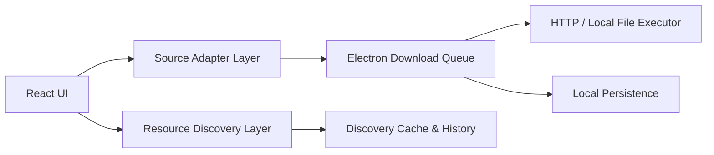

# HongGuo Tool Framework

一个面向桌面工具方向演进的“合法资源管理 + 下载执行 + 适配器扩展”框架。

当前技术栈：

- `React 19`
- `Vite`
- `TypeScript`
- `Electron`

这个项目的目标不是做某个平台的专用下载器，而是提供一套可复用的桌面骨架，让你可以对接自己有权使用的：

- 直链文件资源
- 本地文件资源
- 内部资源目录
- 内部 HTTP API
- 自定义适配器

## 当前状态

项目已经具备一套可运行的桌面应用框架，覆盖：

- 资源目录展示
- 任务队列与真实下载执行
- 断点续传
- 下载日志
- 下载统计
- 本地资源发现层
- 内部 API 资源同步
- 资源发现源管理
- 同步历史
- 可折叠的次要面板 UI

后续如果继续开发，优先关注“新适配器接入”和“资源发现层增强”即可，不需要重做桌面壳或任务系统。

## 合规边界

这个项目当前明确保持以下边界：

- 不接入红果短剧或任何第三方视频平台接口
- 不实现未授权内容抓取、批量解析或绕过限制下载
- 真实下载层只处理你有权使用的直链文件或本地文件
- 资源发现层只适合导入你自己的资源目录或内部 API 返回结果

如果你后续继续开发，也应保持这个边界。

## 已实现功能

### 1. 桌面壳

- Electron 主进程与预加载桥接
- 浏览器预览模式与桌面模式双运行方式
- 原生下载目录选择与打开目录
- Electron `userData` 持久化
- Windows 桌面目录包输出

### 2. 资源展示层

- 资源搜索
- 分类浏览
- 分辨率切换
- 剧集详情展示
- 单集加入队列
- 全集加入队列
- 预览弹窗

### 3. 下载执行层

- HTTP/HTTPS 直链下载
- 本地文件复制式下载
- 并发下载控制
- 暂停 / 恢复
- 失败重试
- 清空失败项
- 清空已完成项
- 打开已下载文件
- 打开所在目录

### 4. 断点续传

- 下载时使用 `.part` 临时文件
- 暂停后保留已下载部分
- 恢复时优先从已下载字节继续
- 本地文件复制支持按偏移继续
- HTTP 任务支持 `Range` 续传
- 远程源不支持 `Range` 时自动回退为从头重下

### 5. 任务持久化与恢复

- 下载任务写入本地任务文件
- 应用重启后恢复历史任务
- 未完成任务恢复为等待中
- 已完成任务会校验目标文件是否还存在
- 缺失文件的历史已完成任务会自动改为失败

### 6. 下载日志

- 下载日志持久化
- 按级别筛选：`信息 / 警告 / 错误`
- 关键词搜索
- JSON 导出
- 一键清空

记录的事件包括：

- 任务入队
- 开始下载
- 断点恢复
- 手动暂停
- 恢复下载
- 失败重试
- 下载完成
- 下载失败
- 应用重启恢复
- `.part` 文件丢失
- `Range` 回退为整文件重下

### 7. 下载统计与任务诊断

- 完成成功率
- 活跃任务数
- 失败适配器数
- 失败原因数
- 按适配器聚合任务表现
- 按失败原因聚合失败任务
- 点击统计项直接联动任务筛选

### 8. 手动资源层

- 手动录入单部资源
- URL 模板下载源
- 本地文件模板下载源
- 手动资源 JSON 导入 / 导出

支持的模板令牌：

- `{episode}`
- `{episodeIndex}`
- `{seriesId}`
- `{seriesTitle}`
- `{episodeTitle}`
- `{resolution}`

### 9. 资源发现层

- 本地 JSON 资源库清单导入
- 本地 JSON 资源库清单导出
- 一次导入多部剧元数据与集列表
- 将资源发现结果并入现有资源目录
- 资源展示与下载地址解析解耦

### 10. 内部 API 发现层

- 从内部 HTTP API 拉取资源目录
- 自定义请求头 JSON
- 成功响应写入本地缓存
- 从缓存恢复资源目录

### 11. 资源发现源管理

- 保存多个内部 API 来源配置
- 按最近使用时间排序
- 快速载入来源
- 直接对某个来源触发同步
- 删除来源配置

### 12. 资源发现同步历史

- 记录本地清单导入
- 记录缓存恢复
- 记录当前 API 同步
- 记录已保存来源同步
- 记录成功 / 失败
- 记录条目数、时间、说明
- 支持清空历史

### 13. 界面优化

- 统一桌面风格配色
- 简洁化卡片与按钮样式
- 更清晰的信息层级
- 次要面板可折叠

当前默认折叠的辅助区域包括：

- 下载健康度
- 手动导入合法资源
- 下载日志

## 快速开始

### 安装依赖

```bash
npm install
```

### 启动浏览器预览

```bash
npm run dev
```

### 启动桌面开发模式

```bash
npm run dev:desktop
```

这会同时启动：

- Vite 前端服务
- Electron 桌面窗口

## 常用脚本

```bash
npm run dev
npm run dev:desktop
npm run build
npm run lint
npm run build:desktop
npm run dist:win
```

说明：

- `dev`：启动 Vite
- `dev:desktop`：启动 Vite + Electron
- `build`：构建前端产物
- `lint`：运行 ESLint
- `build:desktop`：生成桌面目录包
- `dist:win`：生成 Windows 安装包

## 项目结构

### 核心入口

- [electron/main.cjs](/D:/HongGuo_AutoTools/electron/main.cjs)
  Electron 主进程、下载调度、文件保存、缓存与历史持久化、IPC。

- [electron/preload.cjs](/D:/HongGuo_AutoTools/electron/preload.cjs)
  桌面能力桥接层。

- [src/App.tsx](/D:/HongGuo_AutoTools/src/App.tsx)
  主界面、任务交互、资源发现、统计、日志、折叠面板。

- [src/App.css](/D:/HongGuo_AutoTools/src/App.css)
  主界面布局与桌面风格样式。

- [src/index.css](/D:/HongGuo_AutoTools/src/index.css)
  全局主题变量与基础视觉样式。

### 下载与桌面类型

- [src/desktop.ts](/D:/HongGuo_AutoTools/src/desktop.ts)
  桌面上下文、任务模型、日志模型、资源发现缓存与同步历史类型。

- [src/electron.d.ts](/D:/HongGuo_AutoTools/src/electron.d.ts)
  前端可调用的 Electron API 声明。

### 资源与适配器

- [src/sourceAdapters.ts](/D:/HongGuo_AutoTools/src/sourceAdapters.ts)
  对外统一导出适配器能力。

- [src/adapters/registry.ts](/D:/HongGuo_AutoTools/src/adapters/registry.ts)
  适配器注册中心。

- [src/adapters/types.ts](/D:/HongGuo_AutoTools/src/adapters/types.ts)
  适配器协议定义。

- [src/adapters/utils.ts](/D:/HongGuo_AutoTools/src/adapters/utils.ts)
  模板替换、文件名清洗、手动资源转目录等工具。

- [src/adapters/builtins/demoLibrary.ts](/D:/HongGuo_AutoTools/src/adapters/builtins/demoLibrary.ts)
  演示资源适配器。

- [src/adapters/builtins/manualTemplate.ts](/D:/HongGuo_AutoTools/src/adapters/builtins/manualTemplate.ts)
  手动模板适配器。

- [src/adapters/custom/index.ts](/D:/HongGuo_AutoTools/src/adapters/custom/index.ts)
  自定义适配器注册入口。

### 资源清单与发现层

- [src/manualSources.ts](/D:/HongGuo_AutoTools/src/manualSources.ts)
  手动资源清单导入、导出、解析、合并。

- [src/discoveredSources.ts](/D:/HongGuo_AutoTools/src/discoveredSources.ts)
  资源发现层的数据结构、资源库清单解析、系列构建与合并。

- [manifest-templates/resource-library.template.json](/D:/HongGuo_AutoTools/manifest-templates/resource-library.template.json)
  本地资源库清单模板。

### 文档与模板

- [docs/adapter-development.md](/D:/HongGuo_AutoTools/docs/adapter-development.md)
  适配器开发说明。

- [docs/resource-discovery.md](/D:/HongGuo_AutoTools/docs/resource-discovery.md)
  资源发现层说明。

- [adapter-templates/custom-direct-file.adapter.template.ts](/D:/HongGuo_AutoTools/adapter-templates/custom-direct-file.adapter.template.ts)
  自定义适配器模板。

- [adapter-examples/team-library.adapter.example.ts](/D:/HongGuo_AutoTools/adapter-examples/team-library.adapter.example.ts)
  自定义适配器示例。

## 系统分层



### 说明

1. `React UI`
   负责资源展示、任务操作、日志、统计、资源发现与来源管理。

2. `Resource Discovery Layer`
   负责导入本地资源清单、同步内部 API、缓存与同步历史。

3. `Source Adapter Layer`
   把业务资源信息转换成统一下载描述。

4. `Electron Download Queue`
   负责并发调度、状态流转、暂停恢复、IPC 通知。

5. `HTTP / Local File Executor`
   负责真实文件传输与断点续传。

6. `Local Persistence`
   负责保存任务、日志、缓存与同步历史。

## 下载任务执行链路

1. 在 UI 中选择剧集并点击下载
2. `resolveEpisodeDownload()` 根据 `adapterId` 找到适配器
3. 适配器返回统一下载描述：
   `taskId / sourceUrl / fileName / resolution`
4. Electron 主进程将任务加入下载队列
5. 调度器根据最大并发数启动任务
6. 执行器根据 `sourceUrl` 选择：
   HTTP/HTTPS 下载 或 本地文件复制
7. 下载进度通过 IPC 回传前端界面

## 适配器系统

当前内置适配器：

- `demo-library`
  返回公开演示视频直链，用于验证完整链路。

- `manual-template`
  把手动录入的 URL 模板解析成最终下载地址。

适配器最终必须返回：

- `taskId`
- `adapterId`
- `seriesId`
- `seriesTitle`
- `episodeId`
- `episodeTitle`
- `resolution`
- `sourceUrl`
- `fileName`

也就是说，下载执行层不关心资源来自哪里，只关心你是否给出了合法直链或本地文件路径。

### 接入入口

- 模板：[custom-direct-file.adapter.template.ts](/D:/HongGuo_AutoTools/adapter-templates/custom-direct-file.adapter.template.ts)
- 示例：[team-library.adapter.example.ts](/D:/HongGuo_AutoTools/adapter-examples/team-library.adapter.example.ts)
- 文档：[adapter-development.md](/D:/HongGuo_AutoTools/docs/adapter-development.md)
- 注册入口：[index.ts](/D:/HongGuo_AutoTools/src/adapters/custom/index.ts)

## 手动资源清单

导入 / 导出格式示例：

```json
{
  "version": 1,
  "exportedAt": "2026-03-22T12:00:00.000Z",
  "sources": [
    {
      "id": "manual-source-001",
      "title": "示例资源",
      "category": "手动导入",
      "totalEpisodes": 12,
      "urlTemplate": "https://example.com/demo/{episode}.mp4",
      "note": "团队内部测试"
    }
  ]
}
```

导入规则：

- 默认按 `id` 合并
- 相同 `id` 会覆盖旧记录
- 格式不合法会直接报错

## 资源发现层

资源发现层适合一次导入多部剧的元数据与集列表，不直接生成下载地址。

推荐入口：

- 模板：[resource-library.template.json](/D:/HongGuo_AutoTools/manifest-templates/resource-library.template.json)
- 说明：[resource-discovery.md](/D:/HongGuo_AutoTools/docs/resource-discovery.md)

每个资源条目至少需要：

- `title`
- `adapterId`
- `sourceId`

导入规则：

- 按 `id` 合并
- 缺少 `title`、`adapterId` 或 `sourceId` 的条目会被判定为无效
- `episodes` 可选，不写全时界面会自动补齐剩余集数

### 内部 API 接法

内部 HTTP API 直接返回同样的 JSON 结构即可。

Electron 模式下，最近一次成功拉取的响应会缓存到：

- `discovery-library-cache.json`

同一个工作区也可以保存多个资源发现源配置，直接切换和触发同步。

### 同步历史

资源发现同步历史覆盖：

- 本地清单导入
- 从缓存恢复
- 从当前 API 同步
- 从已保存来源同步

Electron 模式下会持久化到：

- `discovery-sync-history.json`

## 持久化文件

Electron 模式下，用户数据目录中会保存：

- `settings.json`
  下载目录、最大并发、默认分辨率

- `download-tasks.json`
  下载任务与恢复状态

- `download-logs.json`
  下载日志，默认保留最近 2000 条

- `discovery-library-cache.json`
  最近一次成功同步的资源目录响应缓存

- `discovery-sync-history.json`
  资源发现同步历史，默认保留最近 200 条

浏览器预览模式下，相关状态会回退到 `localStorage`。

## 当前已知限制

- 真实下载层目前只支持单文件直链或本地文件
- 不支持流媒体分片下载
- HTTP 断点续传依赖远程源支持 `Range`
- 不支持多段并行分片下载
- 下载日志是事件级日志，不是逐字节追踪
- 统计面板是实时视图，不单独生成长期报表文件
- 适配器仍是代码注册，不是运行时热插拔
- 目前没有自动更新机制

## 当前建议的下一步

下次继续开发时，优先顺序建议：

1. 资源发现差异提示
   同步后直接展示新增 / 更新 / 覆盖数量

2. 资源发现源测试与健康检查
   在保存来源前先测试连通性和返回结构

3. 下载统计报表
   增加更长期的成功率、失败率与适配器趋势统计

4. 适配器运行时配置化
   进一步减少“改代码才能接源”的场景

5. 自动更新或版本检查
   提升桌面工具维护体验

## 当前验证状态

最近一轮已验证：

- `npm run build`
- `npm run lint`
- `npm run build:desktop`

桌面目录包输出位置：

- `release/win-unpacked`

## 暂停点

当前 README 已补全到可以直接作为下次继续开发的交接文档。
下次继续时，建议先从“资源发现差异提示”这一层开始，不需要再重新梳理整体结构。
